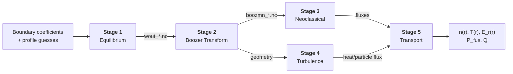

# StellaForge

StellaForge is an open-source pipeline for stellarator design. It connects five physics stages (equilibrium, Boozer transform, neoclassical transport, turbulence, and profile evolution) and their relevant software into a single reproducible workflow. Given a stellarator boundary shape and initial plasma profiles, the pipeline produces transport-consistent density and temperature profiles along with fusion-power metrics.

Each stage is modular so that implementations can be swapped independently. The pipeline is designed to be closed-loop, so output profiles can be fed back as input for iterative optimization.

See [Progress](#progress) below.



Stages 3 and 4 run in parallel. Each stage should eventually be independently swappable (see [guide](docs/guide.md#swappability-patterns)).

## Quick Reference

| Resource                                | Location                                                       |
| --------------------------------------- | -------------------------------------------------------------- |
| Pipeline design & contributor workflow  | [`docs/guide.md`](docs/guide.md)                               |
| Stage I/O specs                         | [`docs/stage{N}-{name}/spec.md`](docs/)                        |
| MVP I/O reference & Pixi commands       | [`docs/mvp-pipeline.md`](docs/mvp-pipeline.md)                 |
| Physics equations & I/O contracts (TeX) | [`stellarator_workflow/`](stellarator_workflow/)               |
| I/O validation methodology              | [`docs/guide.md#io-validation`](docs/guide.md#io-validation)          |
| Coding standards                        | [`docs/guide.md#coding-conventions`](docs/guide.md#coding-conventions) |

## Pipeline Stages

| Stage | Physics | JAX Primary | Alternatives |
|-------|---------|-------------|--------------|
| 1. Equilibrium | Ideal-MHD force balance | [vmec_jax](https://github.com/uwplasma/vmec_jax), [DESC](https://github.com/PlasmaControl/DESC) | [VMEC++](https://github.com/proximafusion/vmecpp) |
| 2. Boozer Transform | Coordinate transform | [booz_xform_jax](https://github.com/uwplasma/booz_xform_jax) | [BOOZ_XFORM](https://github.com/hiddenSymmetries/booz_xform) |
| 3. Neoclassical | Effective ripple, drift-kinetic | [NEO_JAX](https://github.com/uwplasma/NEO_JAX), [sfincs_jax](https://github.com/uwplasma/sfincs_jax) | [NEO](https://github.com/PrincetonUniversity/STELLOPT), [SFINCS](https://github.com/landreman/sfincs) |
| 4. Turbulence | Gyrokinetic equation | [SPECTRAX-GK](https://github.com/uwplasma/SPECTRAX-GK) | [GX](https://bitbucket.org/gyrokinetics/gx), [GENE](https://genecode.org) |
| 5. Transport | Profile evolution, power balance | [NEOPAX](https://github.com/uwplasma/NEOPAX) | [Trinity3D](https://bitbucket.org/gyrokinetics/t3d) |

## Where to Put Code

**Phase 1** work goes into the stage spec docs (`docs/stage{N}-{name}/spec.md`) -- the "TO BE COMPLETED" sections.

**Phase 2** adds containers and tests. Stage dependencies are managed through a Pixi workspace under `stages/` (`stages/pixi.toml` + `stages/pixi.lock`), and a single templated `stages/Dockerfile` builds all stages via build arguments. The Snakemake orchestration environment lives in a separate root-level Pixi workspace (`pixi.toml`) so it can be installed on execution nodes without nesting containers. See [guide](docs/guide.md#container-architecture) for details.

## Workflow

1. [Fork](https://github.com/RKHashmani/StellaForge/fork) the repository and branch from `main` (e.g., `feat/stage1-newsoftware`)
2. Work through the relevant phase in the [Guide](docs/guide.md#getting-started)
3. Open a PR from the fork when deliverables are ready and request a review
4. After review and merge, the corresponding item below gets checked off

## Progress

### Phase 1: Document & Run

Install the primary code, document the API and convergence behavior, write example scripts, set up W&B tracking. Full checklist in the [Guide](docs/guide.md#phase-1-document--run).

- [ ] Stage 1 -- Equilibrium
  - [ ] `vmec_jax`
  - [ ] `DESC`
  - [ ] `VMEC++`
- [ ] Stage 2 -- Boozer Transform
  - [ ] `booz_xform_jax`
  - [ ] `BOOZ_XFORM`
- [ ] Stage 3 -- Neoclassical
  - [ ] `sfincs_jax`
  - [ ] `NEO_JAX`
  - [ ] `NEO`
  - [ ] `SFINCS`
- [ ] Stage 4 -- Turbulence
  - [ ] `SPECTRAX-GK`
  - [ ] `GX`
  - [ ] `GENE`
- [ ] Stage 5 -- Transport
  - [ ] `NEOPAX`
  - [ ] `Trinity3D`

### Phase 2: Containerize & Test

Containerize stages and write tests. Full checklist in the [Guide](docs/guide.md#phase-2-containerize--test).

- [ ] Stage 1 -- Equilibrium
  - [x] `vmec_jax`
  - [x] `DESC`
  - [ ] `VMEC++`
- [x] Stage 2 -- Boozer Transform
  - [x] `booz_xform_jax`
  - [x] `BOOZ_XFORM`
- [ ] Stage 3 -- Neoclassical
  - [x] `NEO_JAX`
  - [x] `sfincs_jax`
  - [ ] `NEO`
  - [x] `SFINCS`
- [ ] Stage 4 -- Turbulence
  - [x] `SPECTRAX-GK`
  - [ ] `GX`
  - [ ] `GENE`
- [ ] Stage 5 -- Transport
  - [x] `NEOPAX`
  - [ ] `Trinity3D`

### Phase 3: Integrate

Snakemake DAG, end-to-end tests, and publishing. Details in the [Guide](docs/guide.md#phase-3-integrate).

- [ ] `config.yaml` + Snakemake DAG
- [ ] Swappability patterns (single-stage, multi-stage, end-to-end)
- [ ] End-to-end integration tests
- [ ] Pipeline-level W&B aggregation
- [ ] GHCR image publishing

## Usage

> [!TODO]
> Document pipeline usage once stages are operational.

### Visualize the pipeline graph

Render the file-flow graph (files as nodes, rules as edges) **including the closed-loop post-processing step** by targeting the convergence signal file:

```
pixi run -e pipeline bash -c 'snakemake --filegraph stages/stage5-post-processing/output/HSX_vacuum_ns201_quickrun/converge_status.json | dot -Tpdf > docs/figs/stellaforge_filegraph.pdf'
```

Omit the target to graph the plain forward pass (stops at Stage 5). Needs a one-time `pixi run -e pipeline dot -c`; see [docs/mvp-pipeline.md](docs/mvp-pipeline.md#visualizing-the-file-flow-graph) for PNG/SVG and `--rulegraph`/`--dag` variants.

<!--
git clone https://github.com/RKHashmani/StellaForge.git
cd StellaForge
git submodule update --init --recursive
snakemake --sdm docker --configfile config.yaml
docker pull ghcr.io/rkhashmani/stellaforge:stage-1-vmec-cpu
-->

## License

[MIT](LICENSE)
